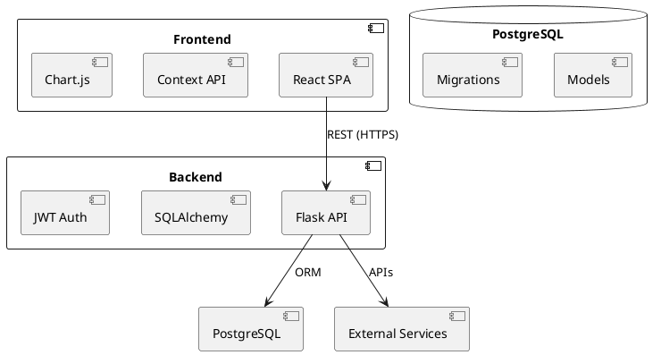
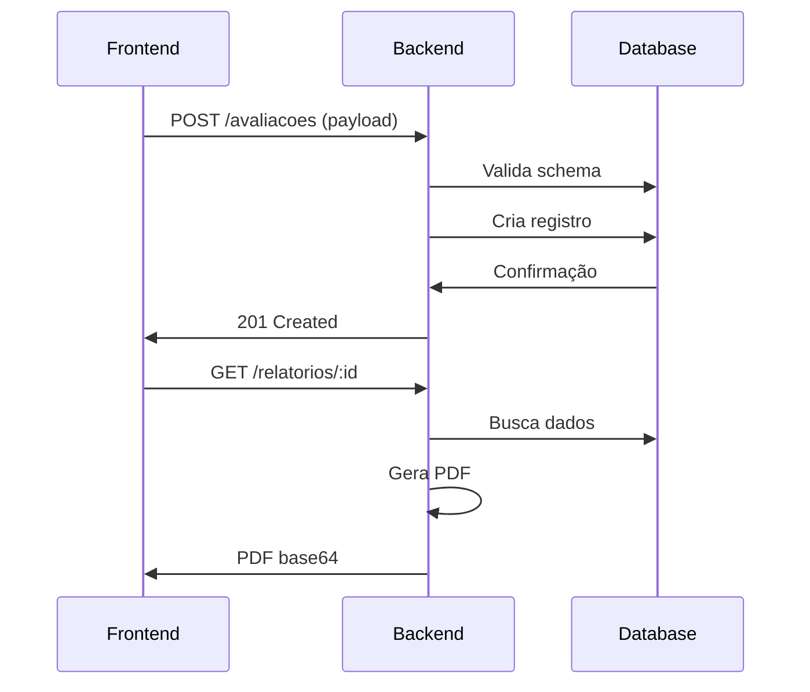
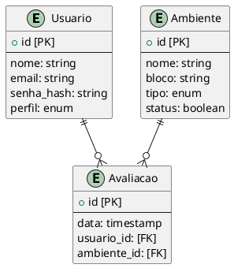

# 📐 Documento de Arquitetura - Sistema de Avaliação 5S

**Versão:** 2.0  
**Última Atualização:** 15/06/2025  
**Responsáveis:** Equipe EasyData360  

---

## 1. Visão Geral da Arquitetura

### 1.1 Estilo Arquitetural
- **Backend**: API RESTful em Flask (Python) seguindo padrão MVC modificado
- **Frontend**: SPA (Single Page Application) em React com TypeScript
- **Comunicação**: JSON via HTTPS com autenticação JWT
- **Banco de Dados**: PostgreSQL com SQLAlchemy ORM

### 1.2 Diagrama Conceitual


---

## 2. Componentes Principais

### 2.1 Backend (Flask)
#### Estrutura de Diretórios:
```
backend/
├── app/
│   ├── controllers/    # Lógica das rotas
│   ├── models/         # Entidades do banco
│   ├── schemas/        # Validação de dados
│   ├── services/       # Regras de negócio
│   ├── utils/          # Helpers
│   └── __init__.py     # Factory app
├── config.py           # Configurações
├── requirements.txt    # Dependências
└── run.py              # Entrypoint
```

#### Stack Tecnológica:
| Componente | Tecnologia | Finalidade |
|------------|------------|------------|
| Framework | Flask | API principal |
| ORM | SQLAlchemy | Acesso ao banco |
| Migrações | Flask-Migrate | Versionamento do schema |
| Autenticação | Flask-JWT-Extended | Gestão de tokens |
| PDF | ReportLab | Geração de relatórios |

### 2.2 Frontend (React)
#### Estrutura de Diretórios:
```
frontend/
├── public/             # Assets estáticos
└── src/
    ├── components/     # UI reutilizável
    ├── hooks/          # Lógica customizada  
    ├── pages/          # Views principais
    ├── services/       # API clients
    ├── styles/         # CSS global
    ├── types/          # Tipos TS
    └── App.tsx         # Componente raiz
```

#### Stack Tecnológica:
| Componente | Tecnologia | Finalidade |
|------------|------------|------------|
| Framework | React 18 | UI principal |
| Estado | Context API | Gestão global |
| Roteamento | React Router | Navegação SPA |
| Gráficos | Recharts | Visualização de dados |
| Calendário | FullCalendar | Agendamentos |
| Formulários | React Hook Form | Validação |

---

## 3. Fluxos de Dados Críticos

### 3.1 Processo de Avaliação


### 3.2 Autenticação
1. Cliente envia credenciais para `/auth/login`
2. Servidor valida e retorna JWT
3. Cliente armazena token no localStorage
4. Cada requisição subsequente inclui header `Authorization`

---

## 4. Modelo de Dados

### 4.1 Diagrama Entidade-Relacionamento


### 4.2 Principais Tabelas
| Tabela | Descrição |
|--------|-----------|
| `usuarios` | Cadastro de inspetores e gestores |
| `ambientes` | Locais avaliados (salas, laboratórios) |  
| `perguntas` | Itens do checklist 5S |
| `avaliacoes` | Registros de vistorias |
| `respostas` | Dados das avaliações |

---

## 5. Segurança

### 5.1 Medidas Implementadas
- **Autenticação**: JWT com tempo de expiração
- **Autorização**: RBAC (Role-Based Access Control)
- **Dados**: Criptografia em trânsito (TLS 1.3)
- **Proteção**: CSRF, CORS e rate limiting

### 5.2 Matriz de Permissões
| Perfil | Ambientes | Avaliações | Relatórios | Usuários |
|--------|-----------|------------|------------|----------|  
| Admin | CRUD | CRUD | CRUD | CRUD |
| Inspetor | R | CRU | R | - |
| Aluno | R | - | R | - |

---

## 6. Considerações de Implantação

### 6.1 Requisitos Mínimos
| Componente | Especificação |
|------------|--------------|
| Servidor | 2vCPU, 4GB RAM |
| Banco | PostgreSQL 12+ |
| Sistema | Linux x64 |

### 6.2 Estratégia de Deploy
1. **Desenvolvimento**: Docker Compose
2. **Homologação**: VM com CI/CD
3. **Produção**: Cluster Kubernetes

```bash
# Comandos de deploy
flask db upgrade
gunicorn -w 4 -b :5000 app:app
```

---

## 7. Roadmap Evolutivo

### Fase 1 (Atual)
- Módulo básico de avaliações
- Geração de relatórios PDF
- Dashboard analítico

### Fase 2 (2024-Q3)  
- [ ] App mobile (React Native)
- [ ] Notificações push
- [ ] Integração com Active Directory

### Fase 3 (2025-Q1)
- [ ] Analytics avançado
- [ ] Controle de ações corretivas
- [ ] API pública para integração

---

## Apêndices

### A. Dependências Críticas
```json
{
  "backend": {
    "flask": "2.3.2",
    "sqlalchemy": "2.0.19",
    "python-jose": "3.3.0"
  },
  "frontend": {
    "react": "18.2.0",
    "axios": "1.3.4",
    "recharts": "2.4.0"
  }
}
```

### B. Padrões de Código
- Backend: PEP 8 com flake8
- Frontend: ESLint Airbnb
- Commits: Conventional Commits
- Branching: Git Flow

### C. Monitoramento
- **Métricas**: Prometheus + Grafana
- **Logs**: ELK Stack
- **Rastreamento**: Sentry
